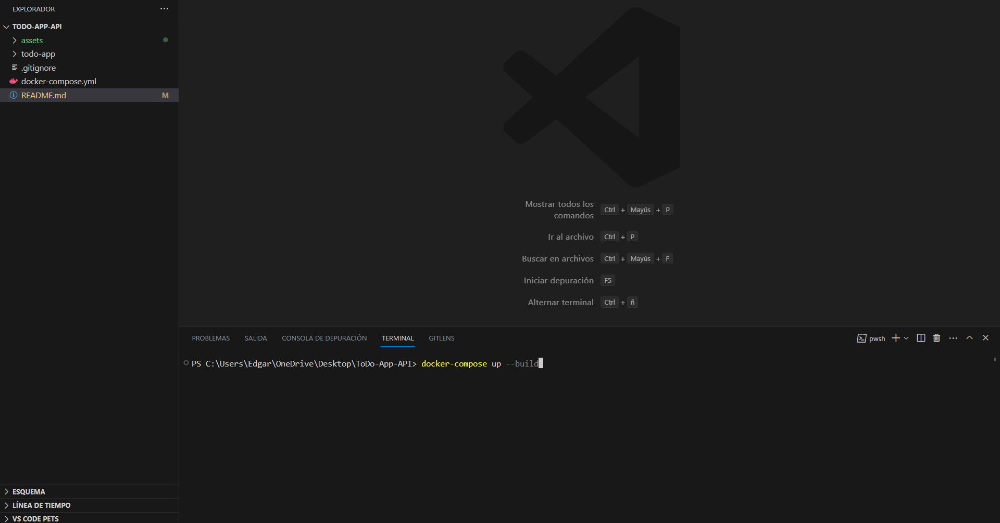

# To Do App

## Table of Contents

- [About](#about)
- [Engineering requirements](#requirements)
- [Back-end Technlogy](#technology)


## About <a name="about"></a>

You are working with a client that needs to implement a to do list to help manage their tasks in their daily job. The client asked you to implement the following functionality: 

- Create a “to do” specifying the name, a priority, and possibly a due date 
- Ability to edit name, priority and due date for existing “to do” tasks 
- They want to be able to specify a due date or clear the due date (because they are not interested in when to finish that “to do”) 
- Be able to filter “to do’s” specifying the name (or part of the name), and the priority, and if they are done/undone. 
- Be able to sort the “to do’s” by priority and/or due date.   
    - For example, be able to sort items where their due date is soon and sort them also by priority to see what tasks are more urgent or less urgent 
- Mark “to do’s” as done (clicking in a checkbox) or to undone a “to do” 
    - The undone functionality is just there if there is a mistake :D 
- Since it is possible that the client will have a lot of “to do’s” they need to paginate the list of “to do’s” 
- Ability to know, in average, the time between creation and done for all “to do’s”. This should be shown in general for all done “to do’s” and also grouped by priority. 
    - This is important for the client since this is a metric they follow to measure performance. 

## Engineering Requirements <a name="requirements"></a>

The Engineering team of the client is asking you to implement the functionality using the following recommendations: 

### Model 

A “to do” should have the following properties: 

- Id. This could be a number or string or a combination. Must be unique. 

- Text (required). Max length is 120 chars. 

- A due date (optional). 

- Done/undone flag 

- A done date. When the “to do” is marked as done this date is set 

- Priority (required). Options: High, Medium and Low. 

- Creation date. 

### API 

- A GET endpoint (/todos) to list “to do’s” 
    - Include pagination. Pages should be of 10 elements. 
    - Sort by priority and/or due date 
    - Filter by done/undone 
    - Filter by the name or part of the name 
    - Filter by priority 

- A POST endpoint (/todos) to create “to do’s” 
    - Validations included 
- A PUT endpoint (/todos/{id}) to update the “to do” name, due date and/or priority 
    - Validations included 

- A POST endpoint (/todos/{id}/done) to mark “to do” as done 
    - This should update the “done date” property 
    - If “to do” is already done nothing should happen (no error returned) 

- A PUT endpoint (/todos/{id}/undone) to mark “to do” as undone 
    - If “to do” is already undone nothing should happen 
    - If “to do” is done, this should clear the done date 

### Database 
No need to use a database by now, storing data could be in memory using Java Collections (no in-memory databases like H2) and it is ok if data is lost when the application is shutdown. But they are asking you to design the persistent layer such that it will be somehow easy to switch from in-memory implementation to a database implementation (they are planning to implement the database implementation later).


## Back-end Technology <a name="tecnnology"></a>
For the back-end project, you have to use: 
- Java 
- Maven  
- Spring Boot 

They need at least the following commands to run the project: 

- mvn spring-boot:run – To run the back-end application 
- mvn test – To run all tests in the back-end application 

Back-end project must run in port 9090. 

## Requirements
- [Docker](https://www.docker.com/)
- Code Editor or IDE (For this example we will use [Visual Studio Code](https://code.visualstudio.com/))
- Install and Run the [ToDo App  API](https://github.com/EdgarRamirezFuentes/ToDo-App-API).


## Installation

The best thing about using the project with docker is that you can setup the Spring environment, run the tests, and run the project by
just running the following command:

```bash
Windows/MacOs
docker-compose up --build

Linux
sudo docker-compose up --build
```

Another advantage of using Docker is that you don't need to care about configuring the development environment in other computers, because Docker uses containers where the project runs, and it works in any computer you use because the Dockerfile contains the container configuration to make the project run in a correct development environment.

### Steps

- Install Docker Desktop 
- Open Docker Desktop. As you can see, at this moment there is no container for our ToDo App API (Spring Project)
- Open this project in Visual Studio Code.


- Open a terminal in Visual Studio Code


- Run the following command in the terminal: ```docker compose up --build```



As you can see, after running the command, Docker will configure the container to run the project.


After the container was configured correctly, Docker will run the test using the command ```mvn test```. If every test passed, Docker will run the project using the command ```mvn spring-boot:run```


- As you can see, Docker shows that the Tomcat is running in ```http://localhost:9090/```.
- Open your Web Browser and go to ```http://localhost:9090/swagger-ui/index.html``` to see the API Docs.


Click [here](https://youtu.be/Wu-HqB15H1o) to see the API being consumed by a React App.
